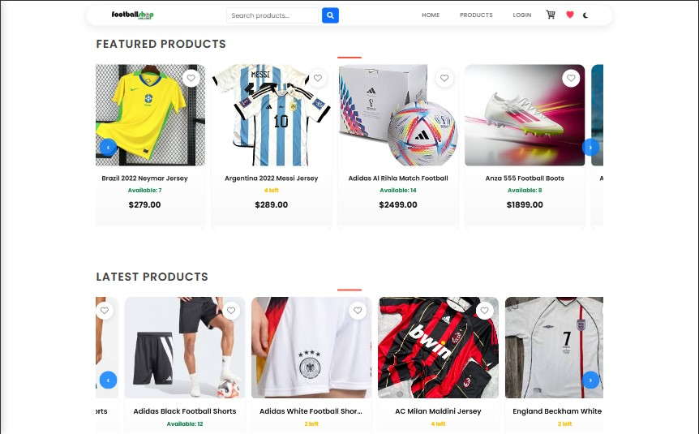
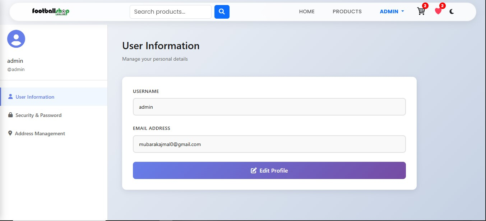
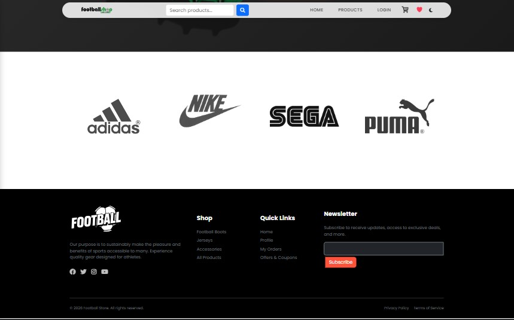

# 🛒 E-Commerce Django Project

A full-featured eCommerce web application built using Django.

## 🚀 Features

* User authentication (login/register)
* Product listing
* Cart system
* Wishlist
* Order management
* Razorpay payment integration

---

## 🛠️ Tech Stack

* Python
* Django
* SQLite (default)
* HTML, CSS, JavaScript

---

## ⚙️ Installation Guide

### 1. Clone the repository

```bash
git clone https://github.com/ajmal-mubarak/E-commerce-full-project.git
cd E-commerce-full-project
```

### 2. Create virtual environment

```bash
python -m venv venv
```

Activate it:

* Windows:

```bash
venv\Scripts\activate
```

* Mac/Linux:

```bash
source venv/bin/activate
```

---

### 3. Install dependencies

```bash
pip install -r requirements.txt
```

---

### 4. Apply migrations

```bash
python manage.py migrate
```

---

### 5. Run the server

```bash
python manage.py runserver
```

---

## 🔐 Environment Variables

Create a `.env` file and add:

```
SECRET_KEY=your_secret_key
DEBUG=True
RAZORPAY_KEY_ID=your_key
RAZORPAY_KEY_SECRET=your_secret
```

---

## 📸 Screenshots

### 🏠 Home Page


### 🏠 Home Page (Variant)


### 🏠 Home Page (More)


### 🛍️ Products Listing


### 📦 Product Detail


### 🛒 Cart Page


### 🎟️ Coupons Page


### ❤️ Wishlist


### 🔐 Login Page


### 👤 Profile Page


### 📦 My Orders


### ⚙️ Admin Panel (Custom)


### 🔻 Footer Section

---

## 📌 Notes

* Do not commit `.env` or `venv`
* Use test mode for Razorpay

---

## 👨‍💻 Author

Ajmal Mubarak
