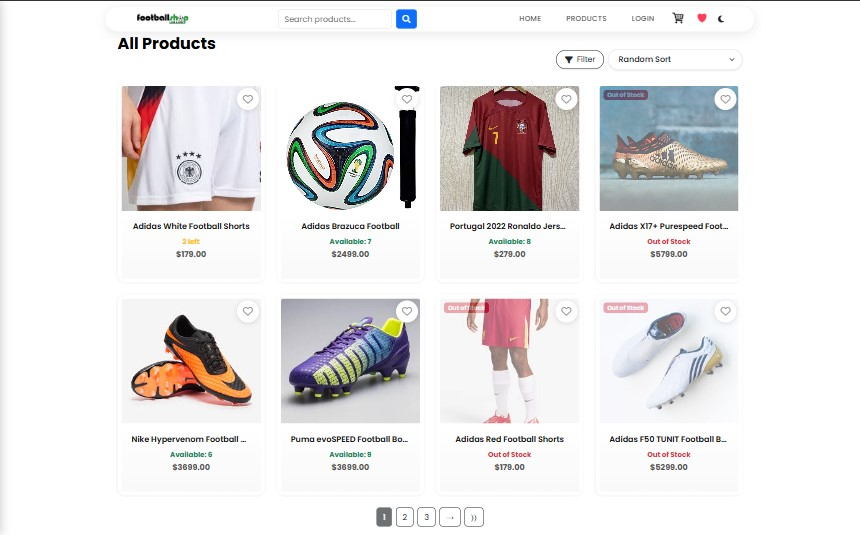
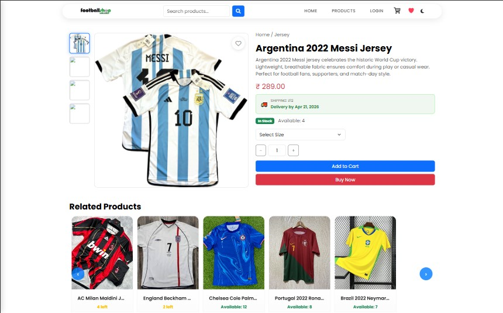
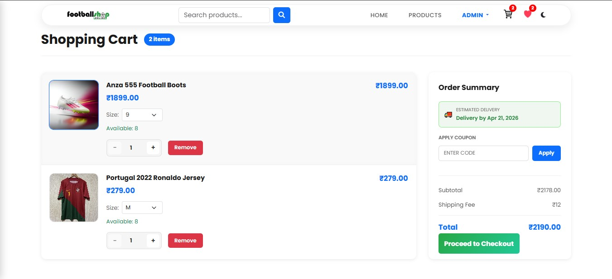
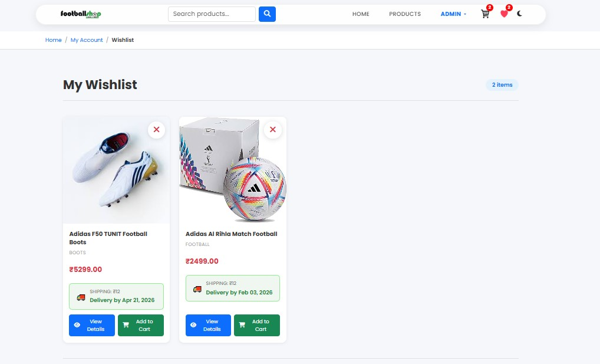
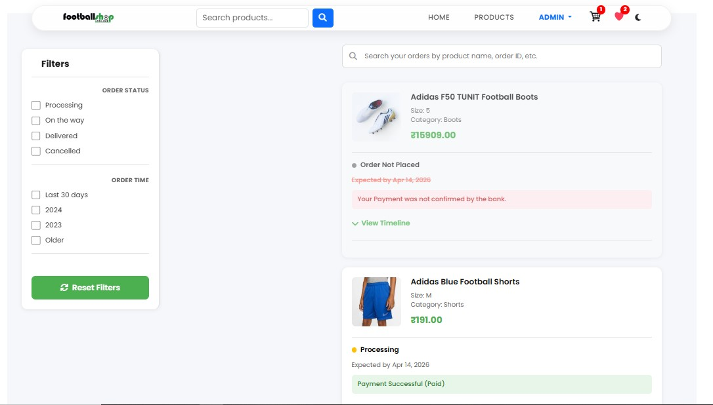
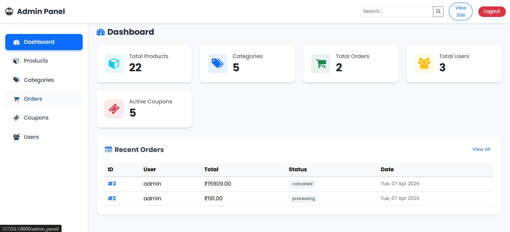

# 🛒 E-Commerce Django Project

A **production-ready eCommerce web application** built with Django, featuring secure authentication, cart & wishlist system, order management, and Razorpay payment integration.

---

## 🚀 Features

* User authentication (Login / Register)
* Product listing & categories
* Cart management system
* Wishlist functionality
* Order management
* Razorpay payment integration
* Custom admin dashboard

---

## 🎯 Purpose

This project was built to demonstrate a **real-world eCommerce application** with complete user flow:

* Authentication
* Product browsing
* Cart & wishlist
* Secure checkout with Razorpay

---

## ⚙️ Key Implementations

* Razorpay payment gateway integration
* Django authentication system
* Session-based cart handling
* Wishlist management
* Order lifecycle tracking
* Custom admin panel UI

---

## 📂 Project Structure

```
football_store/
├── accounts/        # User authentication
├── products/        # Product listing & details
├── cart/            # Cart functionality
├── orders/          # Order management
├── wishlist/        # Wishlist feature
├── templates/       # HTML templates
├── static/          # CSS, JS, Images
├── media/           # Uploaded files
├── football_store/  # Main project settings
```

---

## 🛠️ Tech Stack

* Python
* Django
* SQLite (default)
* HTML, CSS, JavaScript
* Razorpay (Payments)

---

## ⚙️ Installation Guide

### 1. Clone the repository

```bash
git clone https://github.com/ajmal-mubarak/E-commerce-full-project.git
cd E-commerce-full-project
```

---

### 2. Create virtual environment

```bash
python -m venv venv
```

Activate it:

**Windows:**

```bash
venv\Scripts\activate
```

**Mac/Linux:**

```bash
source venv/bin/activate
```

---

### 3. Install dependencies

```bash
pip install -r requirements.txt
```

---

### 4. go to folder football_store

```bash
cd football_store
```

---

### 5. Apply migrations

```bash
python manage.py migrate
```

---

### 6. Create Admin (Superuser)

```bash
python manage.py createsuperuser
```

---

### 7. Run the server

```bash
python manage.py runserver
```

Open:

```
http://127.0.0.1:8000/
```

Admin:

```
http://127.0.0.1:8000/admin/
```

Custom Admin:

```
http://127.0.0.1:8000/admin_panel/
```

---

## 🔐 Environment Variables

Create a `.env` file:

```
SECRET_KEY=your_secret_key
DEBUG=True

EMAIL_HOST_USER=your_email@gmail.com
EMAIL_HOST_PASSWORD=your_app_password

RAZORPAY_KEY_ID=your_key
RAZORPAY_KEY_SECRET=your_secret
```

---

## ⚙️ Additional Setup

### 📧 Email Configuration

* Enable 2-Step Verification in Gmail
* Generate App Password
* Add to `.env`

---

### 💳 Razorpay Setup

* Create account at https://razorpay.com/
* Generate Test API Keys
* Add to `.env`

⚠️ Use test mode during development

---

## 📸 Screenshots

### 🏠 Home Page


### 🛍️ Products Listing



### 📦 Product Detail



### 🛒 Cart Page



### ❤️ Wishlist



### 📦 Orders



### ⚙️ Admin Panel



---

## 📌 Notes

* Do not commit `.env`, `venv`, or sensitive data
* Use Razorpay test mode for development
* Update credentials before production

---

## 🔑 Demo Credentials

Admin:

```
username: admin
password: admin
```

---

## 👨‍💻 Author

**Ajmal Mubarak**
